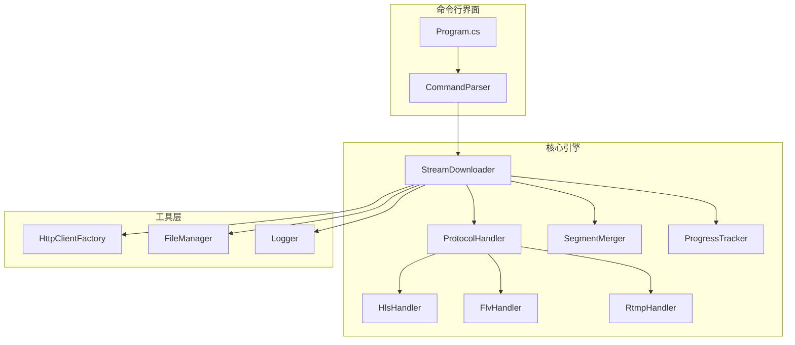
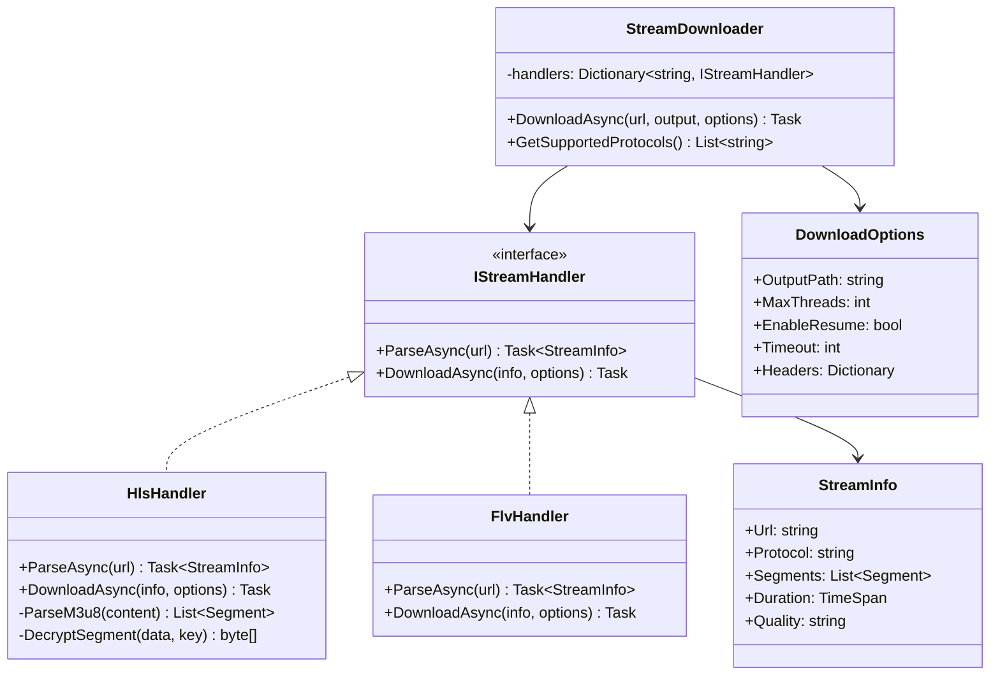

# 直播流媒体下载器 - 项目设计文档

## 1. 系统架构



## 2. 模块设计



## 3. 支持的协议

| 协议 | 扩展名 | 说明 |
|------|--------|------|
| HLS | .m3u8 | HTTP Live Streaming，支持AES-128解密 |
| FLV | .flv | Flash Video，支持直接下载 |
| HTTP-FLV | - | HTTP协议传输的FLV流 |

## 4. 核心功能

### 4.1 HLS下载
- 解析m3u8播放列表
- 支持多级m3u8（master playlist）
- 支持AES-128加密流解密
- 多线程并发下载分片
- 自动合并为MP4/TS

### 4.2 FLV下载
- 支持HTTP-FLV直播流
- 实时录制
- 自动处理FLV Tag

### 4.3 通用功能
- 断点续传
- 自定义HTTP Headers
- 代理支持
- 进度显示
- 日志记录

## 5. 命令行接口

```bash
# 基本用法
StreamDownloader <url> -o <output>

# 完整参数
StreamDownloader <url> 
    -o, --output <path>      输出文件路径
    -t, --threads <num>      并发线程数 (默认: 4)
    -r, --resume             启用断点续传
    --timeout <seconds>      超时时间 (默认: 30)
    --proxy <url>            代理服务器
    --header <key:value>     自定义请求头
    -v, --verbose            详细日志
```

## 6. 技术栈

- **语言**: C# 12 / .NET 8
- **HTTP客户端**: HttpClient + Polly (重试策略)
- **命令行解析**: System.CommandLine
- **日志**: Serilog
- **进度显示**: Spectre.Console
